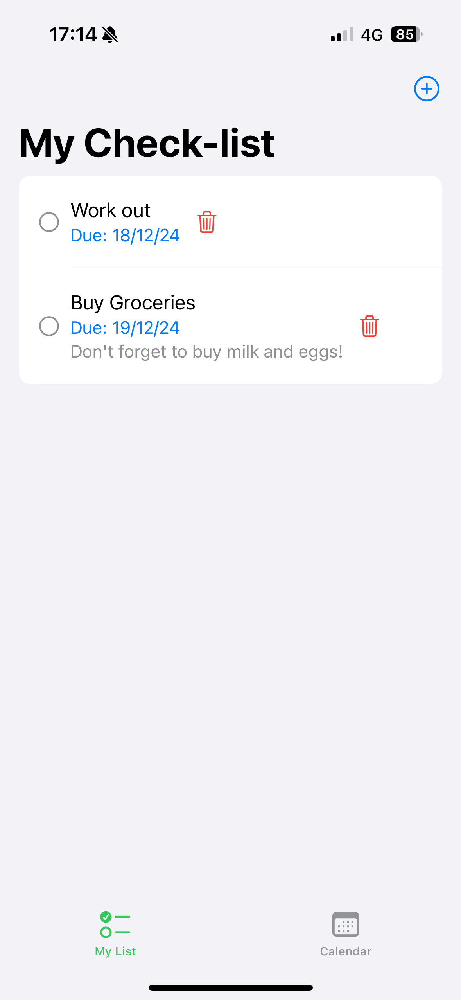
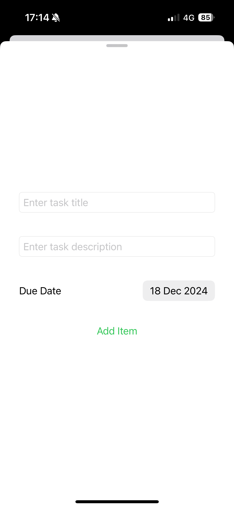
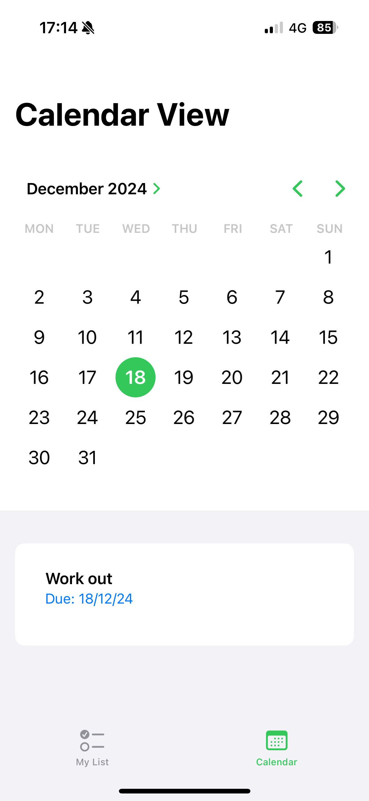

 
# Checkly

📝TaskManager App

This is a simple iOS app built with Xcode that helps users manage their daily tasks.

Whether you're managing daily tasks, tracking deadlines, or keeping an eye on upcoming events, Checkly has all the features you need to stay on top of your day.

   

✨Features
- Add, mark and delete tasks
- View daily tasks in a convenient calendar
- Voiceover accessibility

🔨Installation
1. Clone this repository: `git clone https://github.com/alessiapiscitelli/Checkly.git
2. Open the project in Xcode.
3. Run the app on a simulator or connected device.

📑License

This project is licensed under the MIT License. 

